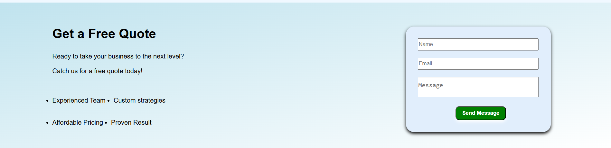
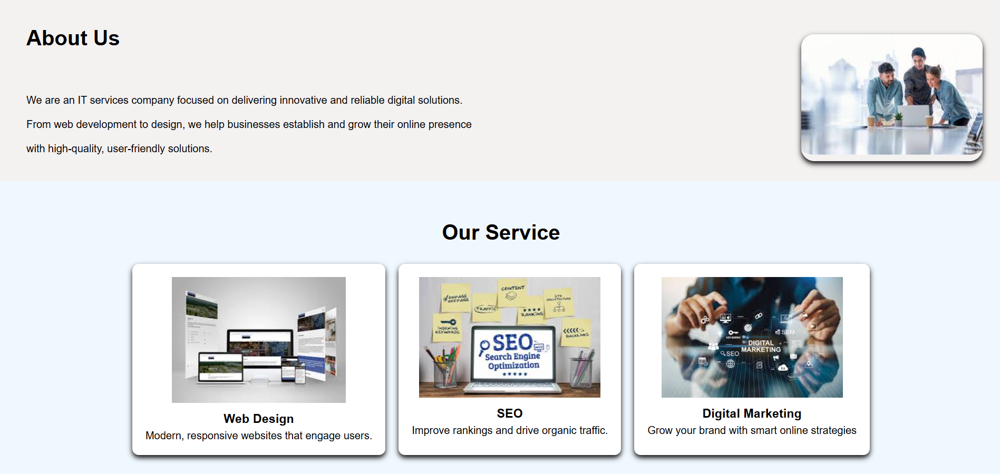
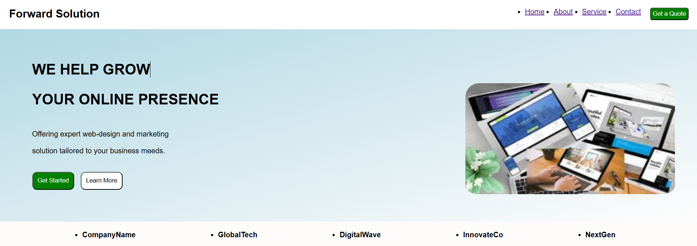

# 🌐 My First Complete Website

Hi, I'm Dishu 👋  
I built this complete business website using HTML and CSS, focusing on layout, design, and user interface.

---

## 🚀 Project Overview
This project is a basic business website that includes multiple sections and a clean layout.

---

## 🧩 Features
- Hero section with call-to-action
- About section
- Services section with cards
- Contact form
- Clean UI using CSS (Flexbox, spacing, shadows)

---

## 🛠️ Technologies Used
- HTML5
- CSS3

---

## 📚 What I Learned
- How to structure a full website
- Using Flexbox for layout
- Styling with CSS (spacing, alignment, shadows)
- Building real-world UI sections

---

## 📸 Screenshots

---

## 💡 Future Improvements
- Make website responsive
- Add animations and hover effects
- Improve UI design

---

## 🙌 Conclusion
This project helped me understand how real websites are built.  
I will continue building more projects and improving my skills 🚀
